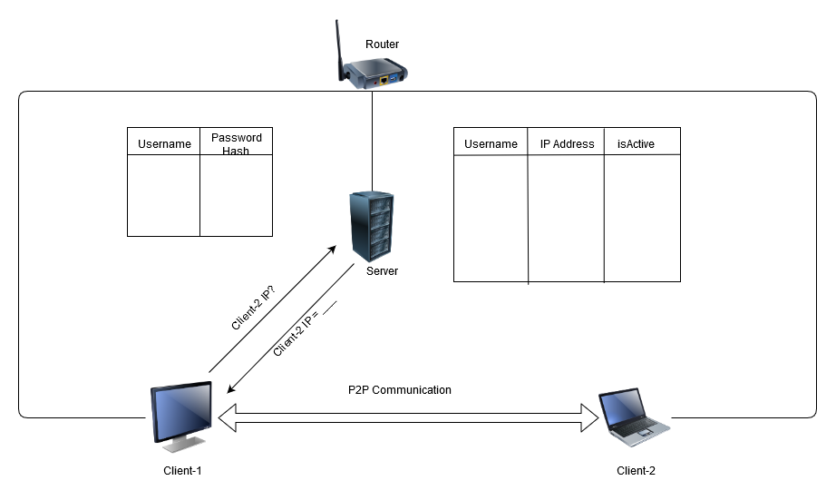
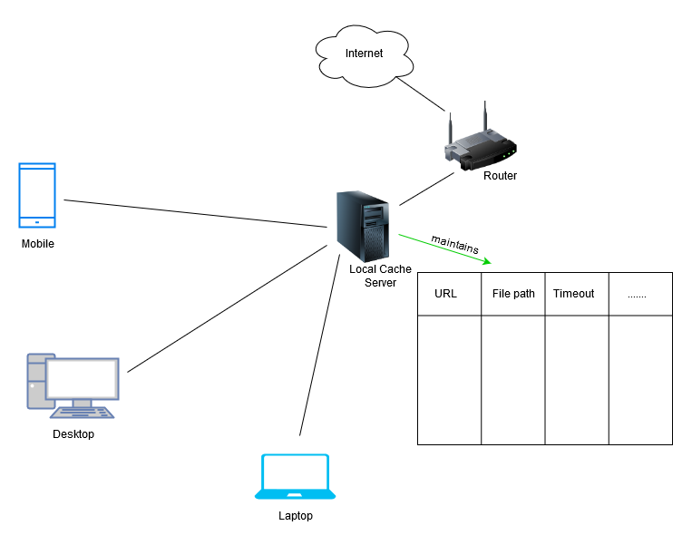
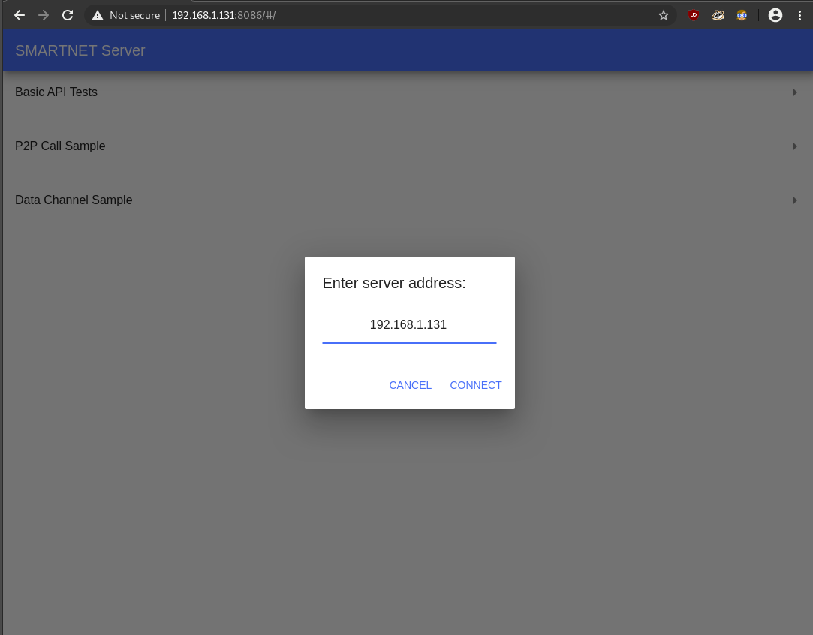
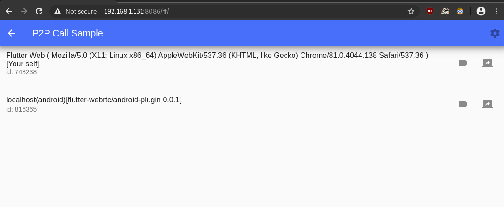
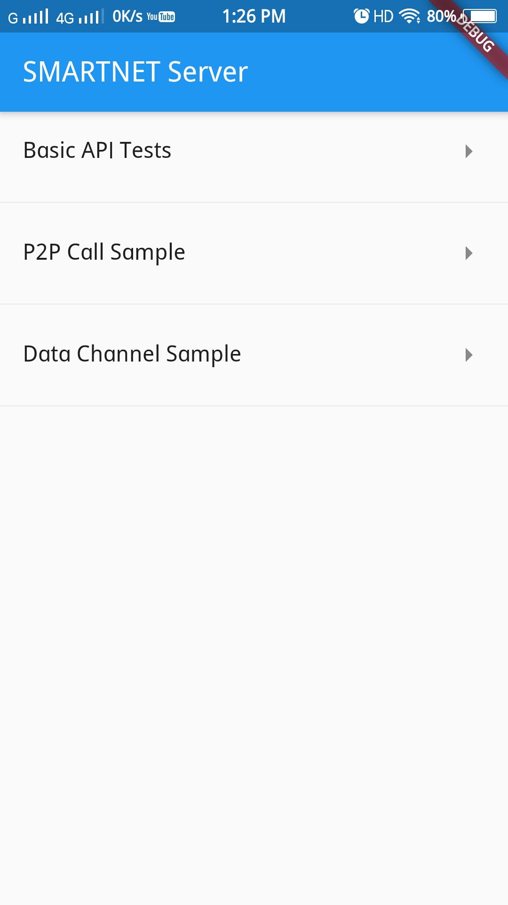
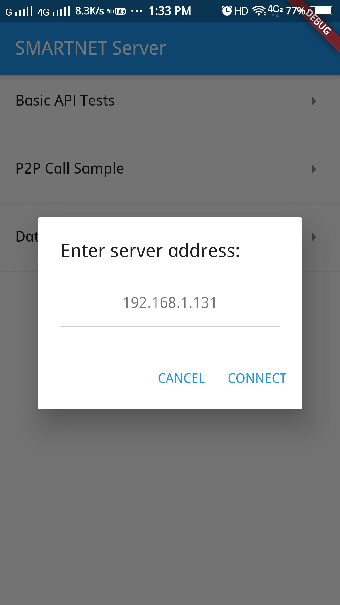
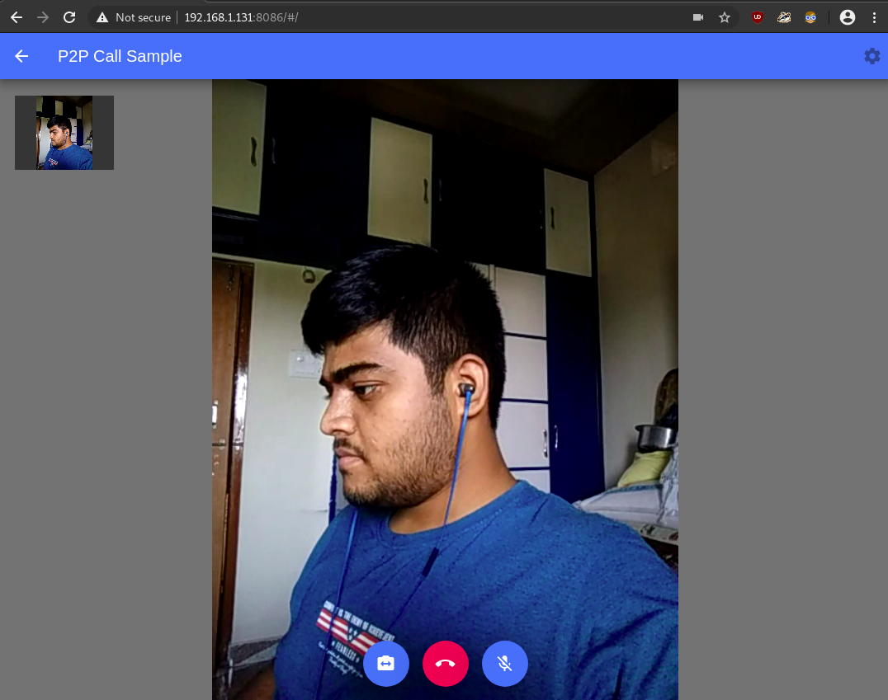
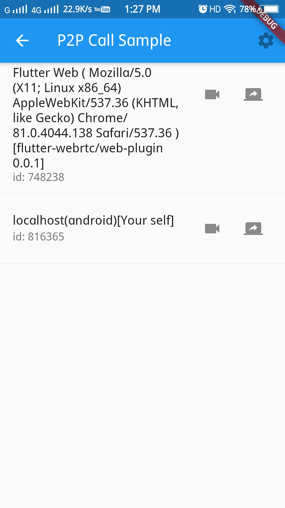

# SMARTNET

The Project Thesis PDF is linked [here](https://drive.google.com/file/d/1wPKL1QRKn_icCYHUUnC_56wVaZNfer1e/view?usp=sharing)

## Team
- [Mohith Kune (me)](https://github.com/Mohith7548)
- [Sunandhini Medi](https://github.com/SunandhiniMedi)
- Bishanth Thota

## Abstract

&nbsp;&nbsp;&nbsp;&nbsp;&nbsp;&nbsp; The Internet has become the centre of everything nowadays. People around the world
can communicate through the internet, thanks to VOIP [1] which involves low costs compared
to telecommunications. However, when the communicating parties are on the same LAN, the
cost of communication can be further optimized by leveraging this concept without the need of
the internet. Unlike other existing solutions which use specific hardware (like VOIP phones),
our project efficiently achieves this by allowing communications through the effective path
using intranet infrastructure and without the use of any special hardware or third-party software
like WhatsApp, zoom etc.

&nbsp;&nbsp;&nbsp;&nbsp;&nbsp;&nbsp; Institutes often opt for high bandwidth internet services intending to serve numerous
users who can also happen to habitually browse or download the same content on the network.
The existing infrastructure incurs huge internet bills and it can be made better to make use of
bandwidth efficiently and reduce internet costs. Our project mitigates it by setting up a web
proxy cache server on the LAN, which caches the most used files and serves effectively
without any delay.

## Functions
- P2P Communication
  - Communication among the users of the same network without external means like the
internet and telephones.
  - The users of the network will be able to make voice calls by logging in to their accounts
at the local server.

- Efficient utilization of Bandwidth
  - The local cache server can store the once downloaded file, and when the same request appears, it redirects the client to download from its local storage.
  - The same server also maintains a cache that helps to re-resolve the requests that are
already once resolved in the past, which thereby reduces the internet bill.

- Secure Monitoring
  - Secure communication between any two systems in the Network
  - The Network administrator is able to monitor students’ activities across the network.

## Technologies used
- WebRTC
- Squid
- Cryptography
- Flutter
- Django

## Screenshots

#### Architecture - P2P Communication

 

#### Architecture - Proxy Cache Server

The above two architectures are same, but shown from point of view of two different uses cases
 

#### Running SMARTNET server

 

#### Server running on 8086 port

 

#### Server acting as client as well, client requires server ip to connect.

 

#### Now, Logged through mobile as well(shown next), we now see total of 2 peers available.

 

#### Now via mobile app
|              Home Page               |               Connecting to Server               |
| :----------------------------------: | :----------------------------------------------: |
|  |  |

 

#### The desktop version communicating with the mobile client

 

#### The mobile version communicating with Desktop client

|              Available Peers               |      Video call with desktop peer      |
| :----------------------------------------: | :------------------------------------: |
|  |  |

 

#### The SMARTNET server asking for authentication credentials on desktop browser

 

#### Requiring credentials on mobile browser

